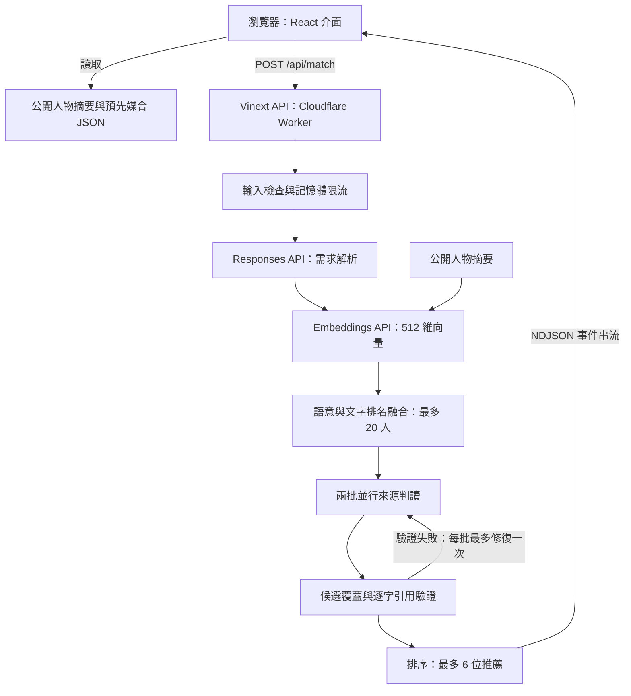

# Boba Connect 技術文件

為 Boba Tech 活動交流需求開發的獨立 AI 媒合模組。

- [公開 Demo](https://boba-connect.stan954054.chatgpt.site/)
- [程式碼與專案簡介](../README.md)
- 文件日期：2026-09-06
- 實作基準：[366bc94](https://github.com/stantheman0128/boba-connect-demo/commit/366bc94bc9dfbac8e592301bcc7ef05056ba9d55)（請以本文件下方的相對程式碼連結閱讀目前版本）。

## 1. 問題、目標與範圍

活動參加者往往不知道現場有哪些人、彼此有什麼交集，以及如何開始交流。主辦方雖有報名背景與需求資料，逐一人工配對仍有成本。Boba Connect 將人物背景與需求轉成候選檢索，再產生有來源支持的推薦理由、開場問題及待確認事項。

本 Demo 的輸出是一個交流起點。推薦不代表對方承諾會面、投資、採購、合作或就業。系統也不把語意相似度或模型排序分數當成成功機率。

目前提供兩個入口：

1. **參加者預先配對**：讀取已生成的推薦，現場不需等待模型。
2. **自填背景與需求**：呼叫 API 即時檢索與核對，顯示真正的執行階段及判定摘要。

正式會員登入整合、邀約通知、聊天室與約會排程不在這份 Demo 的已實作範圍內。

## 2. 系統架構



| 元件 | 實作與責任 |
| --- | --- |
| 前端 | React 19、Vinext；人物選擇、自填表單、推薦卡、來源與即時進度 |
| API | Web Request/Response、ReadableStream；輸入檢查、模型呼叫與結果組裝 |
| 推論 | OpenAI Responses API，預設 `gpt-5-mini`，可由 `OPENAI_MODEL` 覆寫 |
| 向量 | `text-embedding-3-small`，請求 512 維；本機計算 cosine similarity |
| 檢索 | 向量排名與簡單文字命中排名，以 reciprocal rank fusion 合併 |
| 資料 | 隨程式發布的 JSON；本 Demo 未配置 D1、R2 或向量資料庫 |
| 部署 | Vinext / Vite 編譯為 Cloudflare Workers 相容輸出，經 Sites 發布 |

主要入口：[前端](../app/page.tsx)、[媒合 API](../app/api/match/route.ts)、[檢索與驗證核心](../lib/engine.ts)、[建置設定](../vite.config.ts)。

## 3. 人物資料與公開邊界

### 3.1 資料結構

[`Person`](../lib/people.ts) 的欄位如下；以下為合成範例，不對應真實參加者：

```json
{
  "id": "example-001",
  "name": "示範參加者 A",
  "role": "創業者",
  "focus": "企業軟體",
  "intro": "我開發企業工作流程工具，做過訂單 API 整合。",
  "needs": "希望交流企業產品的試點與導入經驗。"
}
```

`id` 用於候選核對與結果關聯；`intro`、`needs` 是引用驗證允許使用的兩個來源欄位。正式使用的 `people` 匯出讀取 [`generated-people.json`](../lib/generated-people.json)。同一模組另保留合成人物與輸入情境，不能把合成人物清單與目前公開的 172 人名單混為一談。

### 3.2 資料處理

公開名單來自活動資料的匿名化概括改寫，並非參加者逐字原話，也不是只替換姓名。[資料準備工具](../scripts/prepare-people.mjs) 要求移除姓名、組織、產品、聯絡方式、精確數字、雇主經歷及可識別細節，檢查部分名稱、連結與長段原文；不通過時退回較保守的表單分類描述。

這些處理不能證明資料完全不可再識別，也不保證概括後保留所有媒合資訊。引用驗證只證明引文存在於公開摘要，不能聲稱它是本人原話。

私人來源、匿名 ID 對照表與中間結果放在被 Git 忽略的 `work/`；公開 repository 不包含重建私人來源所需的資料。一般使用者可直接使用已發布摘要，不需執行私人資料準備流程。

## 4. 即時媒合流程

### 4.1 需求解析

API 將 `background`、`query` 交給需求解析提示詞，以 strict JSON schema 取得：

| 欄位 | 用途 |
| --- | --- |
| `summary` | 一句交流方向摘要 |
| `intent` | `explore` 或 `specific` |
| `needs` | 需求方向字串陣列；提示詞要求 1–4 項，schema 本身沒有數量上限 |
| `searchText` | 檢索用文字，提示詞要求保留專名並可包含雙語詞彙 |

提示詞要求保留否定、必要資格與不同需求，禁止補造募資、招聘或採購意圖。目前沒有另一個確定性邏輯求解器驗證需求是否完整保留，這部分仍依賴模型。

### 4.2 候選檢索

即時路徑將每人的 `role + intro + needs` 建成向量。同一 Worker isolate 內可以重用名單向量快取；冷啟動需重新生成，跨 isolate 不共享，並行冷請求也可能重複生成。

檢索步驟：

1. 對需求解析產生的 `searchText` 取得 query vector。
2. 若帶入 `viewerId`，排除同 ID 人物。這只是排除本人用的參數，不是身分驗證。
3. 計算 cosine similarity 並排序。
4. 文字路徑將英文／數字詞及中文兩字片段去重，統計它們是否出現在 `intro + needs`。這不是完整中文斷詞或 BM25。
5. 以 `1 / (60 + semanticRank) + 1 / (60 + literalRank)` 融合排名，保留最多 20 人。

目前只有一份合併搜尋文字，沒有逐項需求獨立檢索與覆蓋配額。20 人以外的候選不會進入後續模型核對；因此不能宣稱全池召回，也不能由「沒有推薦」推論現場沒有適合的人。

### 4.3 來源判讀與驗證

候選分為最多兩批、每批最多 10 人，以 `Promise.all` 並行判讀。每批輸出所有候選的 `Decision`：

| 欄位 | 意義 |
| --- | --- |
| `id` | 候選 ID |
| `fit` | `strong`、`possible` 或 `none` |
| `relation` | 交流關係標籤 |
| `why` | 連結使用者處境與候選經驗的推薦理由 |
| `talk` | 可開始交流的問題 |
| `gap` | 資料缺口與待確認事項 |
| `score` | 0–100 內部排序值，不是機率；最終推薦輸出移除此欄位 |
| `refs` | `{field, quote}` 陣列，引用候選的 `intro` 或 `needs` |

目前 schema 將候選 ID、引用欄位，以及由完整欄位／句子切出的引文限制為 enum。程式再檢查候選數量、ID 唯一性與合法性、fit、分數範圍，以及引文是否為該人的該欄位連續子字串。`strong` 與 `possible` 必須至少有一筆引用。

驗證失敗時，該批最多重新生成一次；再次失敗則回傳錯誤，不交付未通過驗證的最終推薦。JSON 解析失敗或模型回應未完成不會進入這個引用修復分支。

**逐字引用正確不等於理由的語意推論一定成立。** 人物能力與需求的區分、公司客戶的問題是否為本人公司的採購需求，以及引用能否支持推薦理由，主要由判讀提示詞約束。目前沒有獨立第二模型或人工標註程序保證每次結論正確。

### 4.4 排序與交付

移除 `none`，先排 `strong` 再排 `possible`，同級按分數降序、ID 字典順序打破平手，最多顯示 6 人。`none` 人物以簡短理由另附在 `rejected`。未顯示者可能是候選上限、顯示上限或未通過判讀，不能一律解讀為不適合。

## 5. 預先媒合流程與即時流程的差異

[`scripts/precompute.mjs`](../scripts/precompute.mjs) 使用已公開摘要，在活動前生成 [`precomputed.json`](../public/data/precomputed.json)。

| 項目 | 即時搜尋 | 預先媒合 |
| --- | --- | --- |
| 使用者輸入 | 自填背景與問題 | 人物自己的摘要與需求 |
| 需求規劃 | 一次模型解析 | 不執行；結果中的 plan 為程式組裝 |
| 向量內容 | role、intro、needs | intro、needs |
| 候選 | 最多 20 人 | 排除本人後最多 20 人 |
| 模型輸出 | 每位候選都要判讀 | 僅選出至多 5 人，不要求逐人淘汰理由 |
| 引用限制 | 候選來源 enum，加程式驗證 | 自由引文，加程式驗證 |
| 修復 | 每批最多一次 | 每人最多三次生成嘗試，共含兩次修復 |
| 前端推薦上限 | 6 人 | 5 人 |
| 瀏覽成本 | 執行時呼叫 API | 讀取已保存 JSON，當次零模型呼叫 |

預先媒合對**被選中的人**驗證 ID 與引用，不能將 `reviewed: 20` 解讀為保存了 20 人的完整判定。`rejected` 為空，不代表其他候選都已確認合適。

工具預設有 8 個並行 worker；HTTP 429／5xx 最多額外重試三次，等待間隔遞增。每人結果及向量保存在 `work/precompute/` 供續跑。這些快取沒有完整的資料／模型版本失效機制；改動名單、模型或提示詞後，應先另存舊產物並使用乾淨的工作目錄重算，不能直接混用。

文件撰寫時，repository 的公開產物記錄 `total: 172`、`completed: 172`、`failed: 0`，`results` 有 172 個項目。這是已保存產物的完整度，不是 172 人推薦品質的人工驗證結果，也不證明當前部署已載入同一份產物。

## 6. API 契約與錯誤處理

### 請求

`POST /api/match`，`Content-Type: application/json`：

```json
{
  "background": "我開發企業工作流程工具，正在規劃第一個試點。",
  "query": "想認識有企業系統導入經驗，可以交流需求訪談的人。",
  "viewerId": "example-001"
}
```

`viewerId` 可省略。背景與需求必須為非空字串；背景最多 2,200 字元、需求最多 1,000 字元、原始 JSON 文字最多 5,000 字元。這是 JavaScript 字串長度檢查，不是位元組上限。

串流開始前可能回傳 JSON 錯誤：400 輸入錯誤、403 不同 Origin、429 限流、503 未設定 API key。Origin 存在時才檢查是否同源，缺少 Origin 的直接 HTTP 呼叫不會被此條件拒絕。

### 事件串流

成功開始時回傳 `application/x-ndjson`、`Cache-Control: no-store`。每行是一個 JSON 事件；以下為事件形狀示意，文字與數字不代表實測結果：

```jsonl
{"type":"stage","step":0,"title":"理解你想認識的人","detail":"讀取背景與需求"}
{"type":"plan","plan":{"summary":"交流企業導入經驗","intent":"specific","needs":["企業系統導入"],"searchText":"enterprise integration 企業導入"}}
{"type":"retrieval","step":2,"title":"找到值得核對的線索","detail":"相似不代表適合","candidates":[{"id":"example-002","name":"示範參加者 B","focus":"系統整合"}]}
{"type":"checked","step":3,"done":10,"total":20,"accepted":2,"decisions":[{"id":"example-002","name":"示範參加者 B","fit":"possible","why":"有相關導入經驗","gap":"仍需確認交流意願"}]}
{"type":"error","message":"模型未產生完整結果；本次不顯示未完成的推薦。"}
```

`checked` 按批次完成順序到達。成功終點為 `result`，包含 `matches`、`rejected`、`plan`、`stats` 與 `disclosure`；每個 match 包含判定欄位及公開 `person`，不含內部 score。失敗終點為 `error`。HTTP 串流一旦開始，後續錯誤仍可能伴隨 HTTP 200，客戶端必須解析事件，不能只看狀態碼。

`stats` 包含名單數、核對數、接受數、顯示數、呼叫數、修復數、耗時與模型名稱。即時呼叫數在成功回傳後累加，不能當成所有失敗請求的計費帳本。正常兩批皆成功時通常為需求解析 1 次、embedding 1 次、判讀 2 次；每批修復會再增加一次。

整條即時模型流程使用 170 秒 deadline。畫面呈現真正收到的執行事件與模型判定摘要，不展示內部思考逐字稿。

## 7. 隱私、存取與運作限制

- `OPENAI_API_KEY` 只由伺服器讀取，不提供給前端。使用者背景、問題與核對所需候選摘要會送到 OpenAI。
- Responses 請求使用 `store: false`；應用不將即時輸入加入公開名單。這不等於供應商或託管平台不處理任何請求資料。
- 即時 API 的每 IP 配額為 10 分鐘 8 次，保存在 Worker 記憶體，跨 isolate 或重啟不保證一致，也不是正式的濫用防護或成本上限。
- 本 Demo 沒有會員認證；`viewerId` 不授予權限。目前名單是公開示範資料，不能把此 API 原樣接上私人正式人物資料。
- 提示詞將使用者與人物文字視為不可信資料；這是防禦措施，不構成提示注入絕對安全的證明。
- 冷啟動 embedding、外部 API 配額、網路與生成延遲都會影響回應時間。預先結果降低瀏覽延遲，但可能與更新後資料或提示詞不同步。

## 8. 本機執行與重現

建議 Node.js 24 與 npm；Node 24 可直接執行這裡引用 `.ts` 的批次與測試程式。套件與鎖定版本見 [`package.json`](../package.json) 和 [`package-lock.json`](../package-lock.json)。

```sh
npm ci
```

在本機建立被 Git 忽略的 `.env.local`：

```dotenv
OPENAI_API_KEY=your_server_side_key
OPENAI_MODEL=gpt-5-mini
```

```sh
npm run dev
```

開啟開發伺服器輸出的 Local URL。不設定 key 時可瀏覽公開資料與預先結果，但即時 API 會回傳 503。API key 不能寫進文件、原始碼或公開 repository。

現有檢查指令：

```sh
node --experimental-strip-types --test lib/validation.test.ts
npx tsc --noEmit
npm run lint
npm run build
```

若需要從公開摘要重新產生預先媒合，可執行下列指令。**這會實際呼叫付費 API，並更新公開結果檔案**；一般瀏覽或本次文件變更不需要執行。

```sh
node --env-file=.env.local scripts/precompute.mjs
```

資料準備腳本依賴未公開的私人來源，不屬於 fresh clone 的必要步驟。公開 repository 可重現的是公開摘要上的媒合，不是原始私人資料的完整處理過程。

部署設定見 [`vite.config.ts`](../vite.config.ts) 與 [hosting manifest](../.openai/hosting.json)。`npm run build` 產生 Worker／靜態資產；`npm run start` 透過 Wrangler 在本機預覽建置輸出。正式發布由 Sites 保存版本並部署，runtime key 另設於託管服務；單純 push GitHub 並不等同 Sites 已更新。本次文件變更不需要重部署網站。

## 9. 驗證證據與尚未證明的事

[`lib/validation.test.ts`](../lib/validation.test.ts) 目前只有兩個測試案例，涵蓋錯誤引用拒絕、`none` 不會被排序提升為推薦，以及重複 ID 被拒絕。它們檢查確定性規則，沒有驗證真實模型每次都理解需求。

2026-09-06 本次文件核對：Node.js 24.15.0 下兩個單元測試通過；受限環境不允許測試 runner 建立子程序，因此使用 `node --experimental-strip-types --test --test-isolation=none lib/validation.test.ts` 在同一程序執行。16 個文件相對連結均指向存在的檔案，公開名單與預先結果各有 172 筆。本次只修改文件，未重跑建置、型別檢查、lint 或付費模型流程；不將過去的建置或外部實驗視為本次完整回歸測試。

目前 repository 未提供足以估計推薦 precision／recall 的獨立人工標註集、使用者交流成功率、全池逐人核對證據，或固定延遲／成本保證。提示詞有語意約束，不等於這些語意案例都具備自動化回歸測試。

## 10. 與 Boba Tech 的關係及後續整合

Boba Connect 是為 Boba Tech 活動情境開發的獨立媒合模組，後續預計接入會員平台。既有平台的報名、名錄、人物頁及規則式推薦提供整合場景；先前本機 AI 搜尋／媒合探索提供方法背景。

本次 Demo 的新增範圍包含雙欄互動展示、公開匿名化摘要與預先結果、自填背景與需求的 API 流程、引用驗證及獨立部署。既有平台功能不列入本次新增開發；完整揭露見 [README](../README.md#既有成果揭露)。

正式整合仍需：以登入帳號取得本人資料、在檢索及交付時檢查名錄可見性、對資料變更或撤回同意使舊結果失效、建立版本化結果與持久配額，並將預先配對接入會員推薦介面。這些是後續工作，不能由 Demo 的公開人物選擇器推定已完成。
